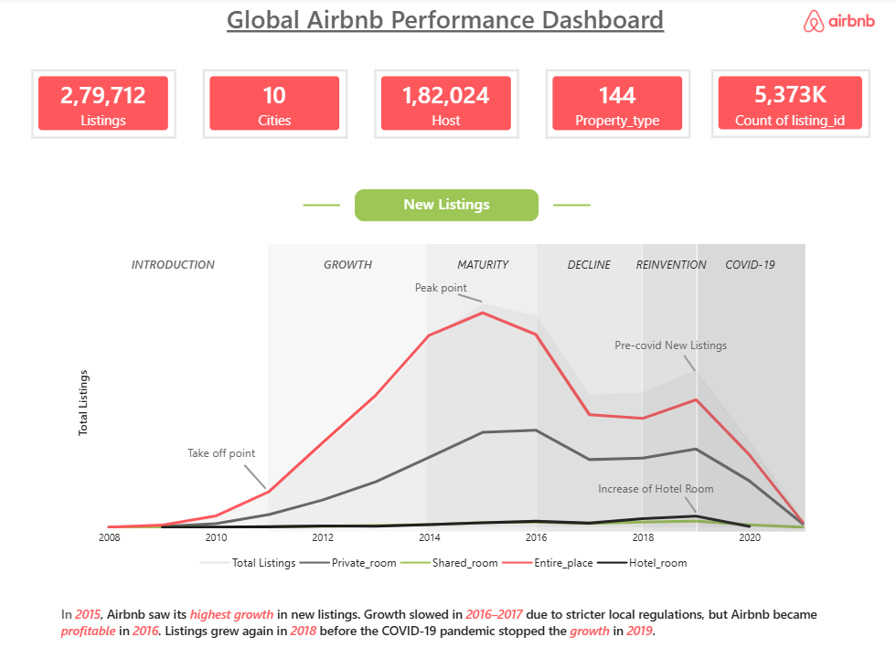
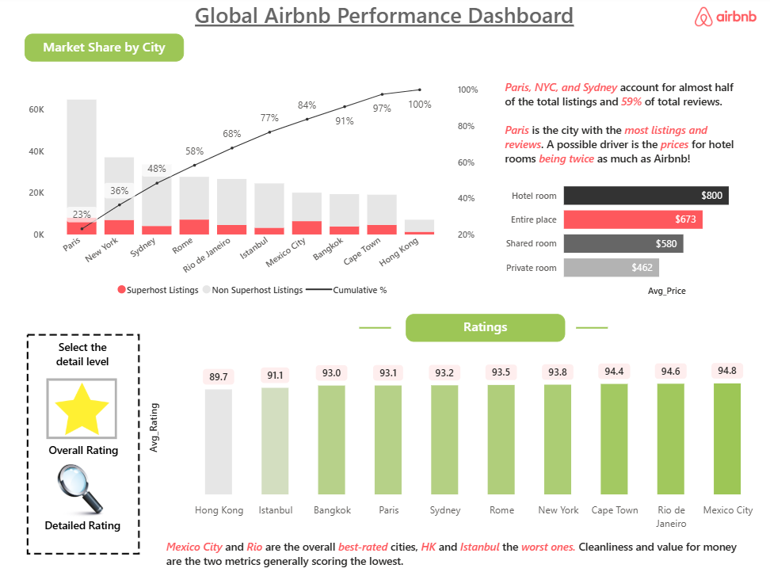
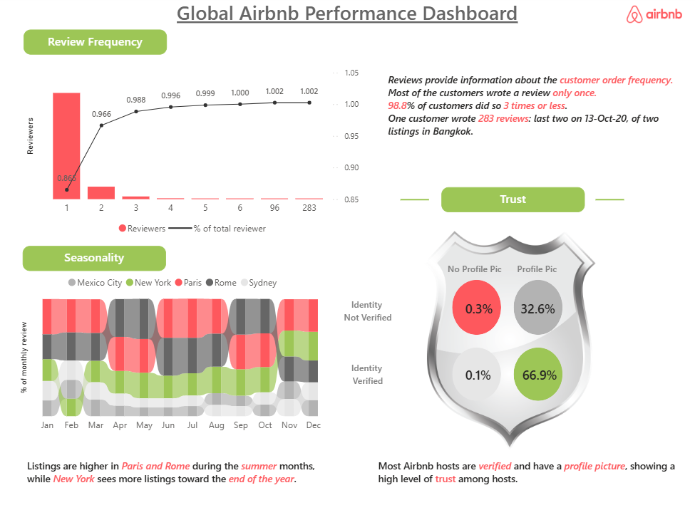
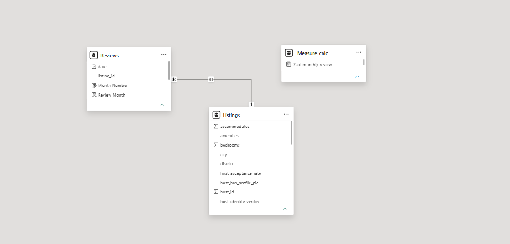

# 🏠 Airbnb Global Performance Dashboard

An interactive **Power BI dashboard** built to analyze Airbnb listing performance across multiple cities. This project focuses on listing growth, market share, ratings, review behavior, seasonality, pricing, and host trust.

## 🔗 Live Power BI Dashboard

👉 **[View the Interactive Airbnb Global Performance Dashboard](https://app.powerbi.com/view?r=eyJrIjoiNTg3OWU3ZjAtYWU5YS00NDIwLWIzNjMtNzhiZWFiMDk4YmY3IiwidCI6ImM2ZTU0OWIzLTVmNDUtNDAzMi1hYWU5LWQ0MjQ0ZGM1YjJjNCJ9)**

---

## 📊 Dashboard Preview

### 1. New Listings & Growth



### 2. Market Share, Pricing & Ratings



### 3. Review Frequency, Seasonality & Host Trust



### 4. Power BI Data Model



---

## 🎯 Project Objective

The objective of this project is to transform Airbnb listing and review data into an interactive business intelligence solution to analyze:

- Listing growth over time
- City-level market share
- Property-type performance
- Average pricing
- Customer ratings
- Review frequency
- Seasonal trends
- Host verification
- Host profile-picture availability
- Airbnb growth and decline periods

---

## 📌 Key Dashboard Metrics

| KPI | Value |
|---|---:|
| Total Listings | 279,712 |
| Cities Covered | 10 |
| Hosts | 182,024 |
| Property Types | 144 |
| Listing ID Count | 5.373M |

---

## 🔍 Dashboard Sections

### 1. New Listings & Growth

Analyzes historical Airbnb listing trends across different property types and business periods:

- Initial Growth
- Peak / Maturity
- Decline
- Re-invention
- COVID-19 Period

Property types analyzed:

- Entire Place
- Private Room
- Shared Room
- Hotel Room

### 2. Market Share by City

Analyzes Airbnb's distribution across major cities using:

- Superhost vs. Non-Superhost listings
- Cumulative market share
- City-wise listing volume
- Average price by property type

Cities included:

**Paris, New York, Sydney, Rome, Rio de Janeiro, Istanbul, Mexico City, Bangkok, Cape Town, and Hong Kong.**

### 3. Ratings Analysis

Compares average ratings across cities to understand differences in customer experience.

### 4. Review Frequency

Analyzes how frequently customers leave reviews and the distribution of reviewers based on review count.

### 5. Seasonality

Analyzes monthly activity patterns across selected cities:

- Mexico City
- New York
- Paris
- Rome
- Sydney

### 6. Host Trust

Analyzes:

- Identity Verified vs. Not Verified
- Profile Picture Available vs. Not Available

This provides insights into host verification and profile completeness.

---

## 🛠️ Tools & Technologies

- **Power BI**
- **Power Query**
- **DAX**
- **Data Modeling**
- **Data Visualization**
- **Business Intelligence**

### Power BI Concepts Used

- KPI Cards
- Line Charts
- Bar Charts
- Column Charts
- Combo Charts
- Conditional Formatting
- Filters and Slicers
- DAX Measures
- Relationships
- Data Modeling
- Drill-down
- Dashboard Storytelling

---

## 🧮 Data Model

The dashboard uses a relational data model connecting Airbnb listing information with review data.

### Listings Table

Key fields include:

- listing_id
- host_id
- city
- property_type
- accommodates
- bedrooms
- host_acceptance_rate
- host_has_profile_pic
- host_identity_verified
- and other listing attributes

### Reviews Table

Key fields include:

- listing_id
- date
- review_month
- month_number

### Measure Calculation

A dedicated measure calculation table is used to organize DAX measures used throughout the dashboard.

### Relationship

```text
Reviews
   │
   │ listing_id
   ▼
Listings

Measure_Calc
   │
   └── DAX Measures
